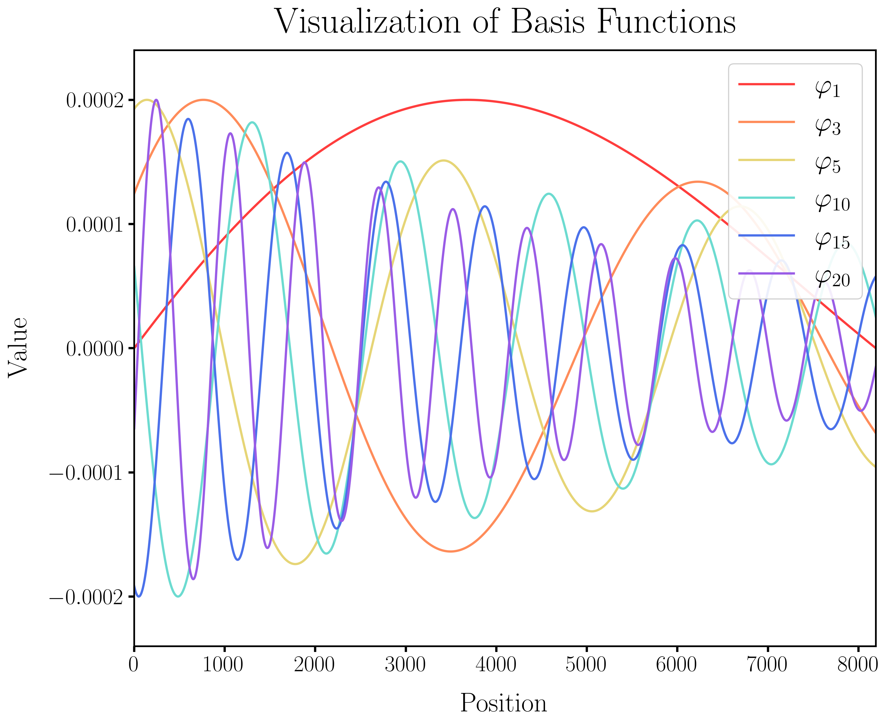
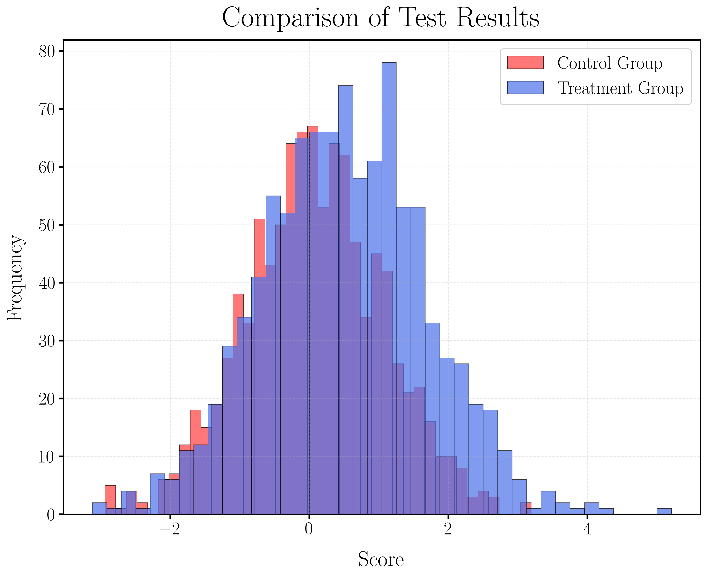
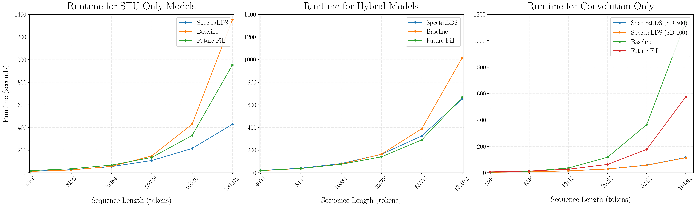
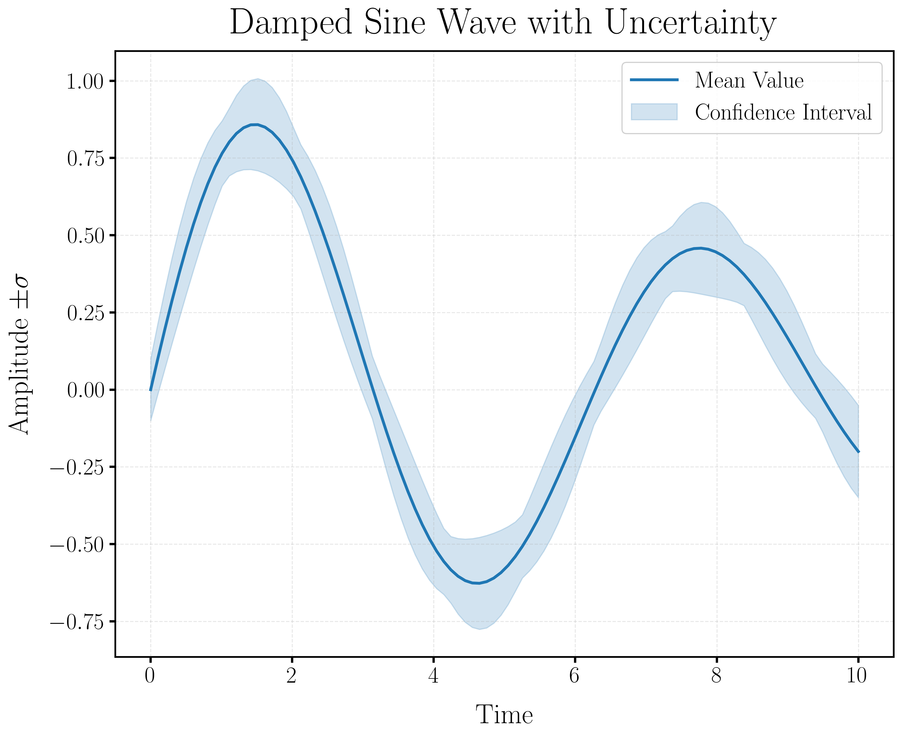
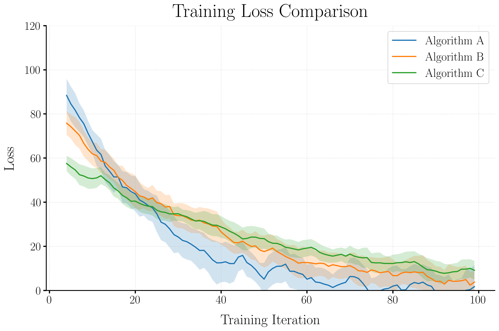

# PrettyPlots



PrettyPlots is a Python library that simplifies the creation of publication-quality visualizations. Built on top of Matplotlib, it provides a consistent API for creating beautiful research plots with minimal effort while maintaining full customization capabilities.


## Features

- **Publication-Ready Styling**: Create beautiful, publication-quality plots with minimal code
- **Consistent API**: Unified interface for different plot types with sensible defaults
- **Multiple Plot Types**: Support for line plots, bar charts, histograms, confidence plots, and more
- **Preset Styles**: Choose from styles optimized for research papers, presentations, and more
- **LaTeX Integration**: Seamless LaTeX rendering for mathematical notation
- **Customization**: Full control over fonts, colors, markers, and other visual aspects
- **Easy Saving**: Save plots in multiple formats with a single command

## Installation (WIP -- for now, git clone)

```bash
pip install prettyplots
```

## Quick Start

```python
import numpy as np
from pretty_plots import PrettyPlots as pp

# Generate data
x = np.linspace(0, 10, 100)
y1 = np.sin(x)
y2 = np.cos(x)

# Create plot
fig, ax = pp.line_plot(
    x_values=[x, x],
    y_values=[y1, y2],
    labels=["sin(x)", "cos(x)"],
    title="Trigonometric Functions",
    xlabel="x",
    ylabel="f(x)",
    style_name="research_paper"
)

# Save and display
pp.save_figure(fig, "trigonometric_functions", formats=["png", "pdf"])
pp.show()
```

## Examples

### Double Histogram

```python
import numpy as np
from pretty_plots import PrettyPlots as pp

# Generate two datasets
np.random.seed(0)
data1 = np.random.normal(0, 1, 1000)
data2 = np.random.normal(1, 1.2, 1000)

# Create double histogram
fig, ax = pp.double_histogram(
    data1=data1,
    data2=data2,
    label1="Group 1",
    label2="Group 2",
    title="Distribution Comparison",
    xlabel="Value",
    ylabel="Frequency",
    style_name="histogram"
)

pp.save_figure(fig, "double_histogram_example", formats=["png"])
pp.show()
```



### Triple Subplot

```python
import numpy as np
from pretty_plots import PrettyPlots as pp

x = [np.linspace(1, 100, 100) for _ in range(3)]
y = [
    [np.log(x[0]), np.sqrt(x[0])],
    [np.exp(-x[1]/50), np.exp(-x[1]/70)],
    [np.sin(x[2]/10), np.cos(x[2]/10)]
]
labels = [["log(x)", "sqrt(x)"], ["exp(-x/50)", "exp(-x/70)"], ["sin(x/10)", "cos(x/10)"]]

fig, axes = pp.triple_subplot(
    x_values=x,
    y_values=y,
    subplot_titles=["Log & Sqrt", "Exponentials", "Trig Functions"],
    labels=labels,
    main_title="Triple Subplot Example",
    xlabel="X",
    ylabel="Y",
    style_name="research_paper"
)

pp.save_figure(fig, "triple_subplot_example", formats=["png"])
pp.show()
```



### Confidence Plot

```python
import numpy as np
from pretty_plots import PrettyPlots as pp

x = np.linspace(0, 10, 100)
y = np.sin(x) * np.exp(-0.1 * x)
errors = 0.1 + 0.05 * np.abs(np.sin(3*x))

fig, ax = pp.confidence_plot(
    x_values=x,
    y_values=y,
    error_values=errors,
    title="Damped Sine Wave with Uncertainty",
    xlabel="Time",
    ylabel="Amplitude $\\pm \\sigma$",
    style_name="research_paper"
)

pp.save_figure(fig, "confidence_plot_example", formats=["png"])
pp.show()
```



### Experiment Plot

```python
import numpy as np
from pretty_plots import PrettyPlots as pp

n_steps = 100
n_runs = 5
exp1_data = [100 * np.exp(-0.05 * np.arange(n_steps)) + 10 * np.random.randn(n_steps) for _ in range(n_runs)]
exp2_data = [80 * np.exp(-0.03 * np.arange(n_steps)) + 8 * np.random.randn(n_steps) for _ in range(n_runs)]
exp3_data = [60 * np.exp(-0.02 * np.arange(n_steps)) + 5 * np.random.randn(n_steps) for _ in range(n_runs)]
data_dict = {
    "Algorithm A": exp1_data,
    "Algorithm B": exp2_data,
    "Algorithm C": exp3_data
}

fig, ax = pp.experiment_plot(
    data_dict=data_dict,
    title="Training Loss Comparison",
    xlabel="Training Iteration",
    ylabel="Loss",
    smoothing=5,
    ylim=(0, 120),
    style_name="research_paper"
)

pp.save_figure(fig, "experiment_plot_example", formats=["png"])
pp.show()
```



## Available Plot Types

PrettyPlots supports a wide range of visualization types:

1. **Line Plots**: `pp.line_plot()` - Basic line plots with multiple series
2. **Multi-Line Comparison**: `pp.multi_line_comparison()` - Compare multiple sets of lines in subplots
3. **Bar Plots**: `pp.bar_plot()` - Grouped bar charts for comparing categories
4. **Histograms**: `pp.histogram()` - Visualize distributions
5. **Double Histograms**: `pp.double_histogram()` - Compare two distributions
6. **Confidence Plots**: `pp.confidence_plot()` - Plot means with error bands
7. **Experiment Plots**: `pp.experiment_plot()` - Visualize multiple experimental runs with confidence intervals
8. **Sequence Comparison**: `pp.sequence_comparison()` - Compare pairs of sequences
9. **Triple Subplot**: `pp.triple_subplot()` - Create three related subplots
10. **Loss Comparison Bar**: `pp.loss_comparison_bar()` - Compare losses across models and parameters
11. **Basis Functions Plot**: `pp.basis_functions_plot()` - Visualize basis functions
12. **Heatmap**: `pp.heatmap()` - Create heatmaps for correlation matrices or other 2D data

## Style System

PrettyPlots provides several predefined styles:

- `research_paper`: High-quality plots for academic papers (LaTeX enabled)
- `presentation`: Cleaner style for slides
- `simple`: Basic style with minimal decoration
- `minimal`: Minimal styling
- `histogram`: Special style for histograms
- `bar_chart`: Style optimized for bar charts
- `basis_functions`: Style for basis function visualization

## Best Practices

1. Start with the predefined styles - they've been designed to look good out of the box
2. Use the default font sizes and line widths - only customize if necessary
3. Use LaTeX rendering (`use_latex=True`) for mathematical symbols
4. Use consistent styles across all figures in your publication
5. When creating multiple plots for a paper, maintain visual consistency

## Contributing

Contributions are welcome! Please feel free to submit a Pull Request.

## Acknowledgments

- Built with [Matplotlib](https://matplotlib.org/)
- Inspired by the need for consistent, publication-quality visualizations in academic research
